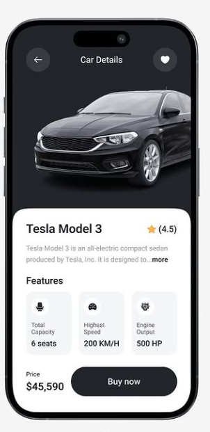

# Car Marketplace App

A modern Flutter application for car shopping featuring a sleek UI, smooth animations, and comprehensive car details display.

## Features

### Car Details Screen
- Elegant car showcase with high-quality image display
- Car information including:
  - Price
  - Brand
  - Model
  - Year
  - Specifications
- Features display
  - Color options
  - Technical specifications
  - Performance metrics
- Smooth animations on screen transitions
- Intuitive navigation with gesture support

### Brand Showcase
- Grid display of popular car brands
- Brand logos with clean presentation
- Quick navigation to brand-specific models
- Responsive layout adapting to screen sizes

### Car Listings
- Comprehensive car listing with filtering options
- For each car:
  - Featured image
  - Brand and model
  - Price
  - Key specifications
- Clean grid/list view layout
- Smooth scrolling experience

## Implementation Details

### State Management
- Clean architecture implementation
- Efficient state handling for UI updates
- Organized data flow

### Animations
- Custom FadeSlideAnimation mixin
- Smooth screen transitions
- Enhanced user experience with animated elements
- Gesture-based interactions

### UI/UX
- Modern and minimalist design
- Dark theme optimization
- Responsive layouts for all screen sizes
- Intuitive navigation patterns

## Getting Started

1. Clone the repository


git clone https://github.com/31SUFI/Car_Shop

## Screenshots



2. Install dependencies
```bash
flutter pub get
```

3. Run the app
```bash
flutter run
```

## Dependencies
```yaml
dependencies:
  flutter:
    sdk: flutter
  flutter_svg: ^latest_version
  google_fonts: ^latest_version
  # Add other dependencies
```
# Contributing
1. Fork the repository
2. Create your feature branch (`git checkout -b feature/AmazingFeature`)
3. Commit your changes (`git commit -m 'Add some AmazingFeature'`)
4. Push to the branch (`git push origin feature/AmazingFeature`)
5. Open a Pull Request